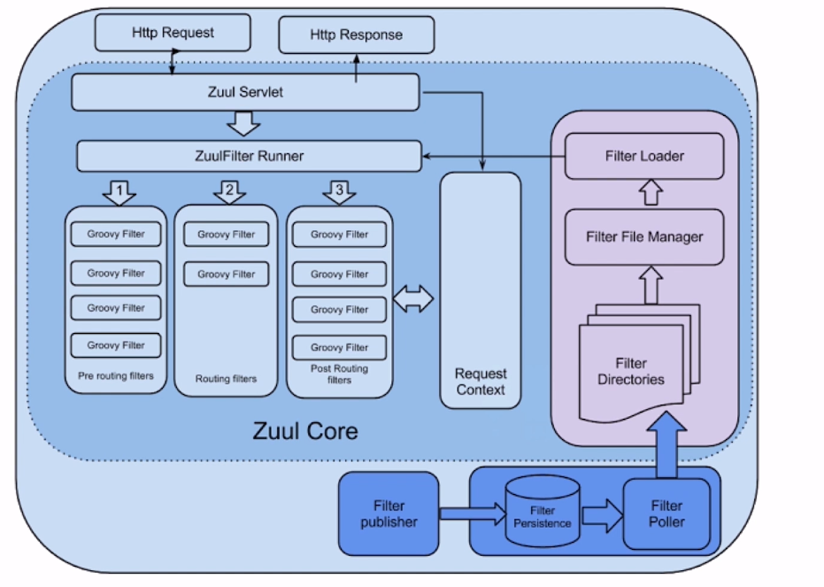
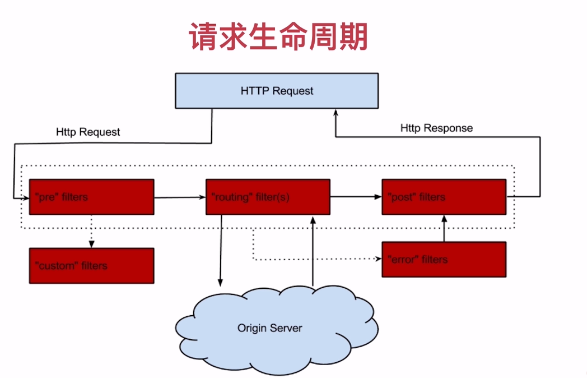

# 服务网关

服务网关作为微服务的统一入口，应该具备以下特点：

- 稳定性、高可用
- 性能、并发性
- 安全性
- 扩展性

### 常见网关的方案

- Nginx + lua (极强)
- Kong (升级版，商业软件)
- Tyk ( go 语言开发)
- Spring Cloud Zuul (性能问题)

Nginx + Zuul 

### Zuul

路由 + 过滤器 = Zuul

核心是一系列的过滤器

### Zuul 的四种过滤器 API

- 前置（pre）: 限流、鉴权、参数校验调整
- 后置（post）：统计、日志、
- 路由（route）
- 错误（error）

### 路由的转换

uri 指相应服务的地址

http://localhost:9000/serverName/uri

### 高可用

多个 Zuul 节点注册到 Eureka Server 上，Nginx 和 Zuul 混搭