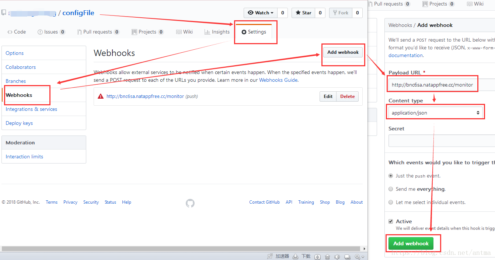

# SpringCloud 统一配置中心

Eureka 的客户端需要配 Config 注册的服务名，如何检测配置文件是否拉取下来？

如果 git 上配置中心仓库的文件包含 order.yml,order-dev.yml,order-test.yml

- http://localhost:config-server/order.yml
- http://localhost:config-server/order.json
- http://localhost:config-server/order.properties

### 客户端的配置
以 order 项目为例，配置信息必须在 bootstrap.yml 中心， ConfigClient 服务启动后，默认会先访问bootstrap.yml，然后绑定
ConfigServer，然后获取 application.yml 配置。如果仅仅在 application.yml 配置了url:http://127.0.0.1:8080 这样默认
会使用8888端口，（配置无效）。 所以，我们将绑定ConfigServer的配置属性应该放在bootstrap.yml文件里.

**特别注意的是，SpringCloud 这里需要的文件是 dev ,但是若存在 order ，则会把 order 中的配置加入其中，简单来说，order
就是通用配置文件。**

```yml
eureka:
  client:
    # 注册服务中心
    service-url:
      defaultZone: http://47.105.218.58:8763/eureka/,http://47.105.218.58:8761/eureka/,http://47.105.218.58:8762/eureka/

# 必须是这个 bootstrap 配置才有效
spring:
  application:
    name: order
  cloud:
    config:
      discovery:
        enabled: true
        service-id: CONFIG-SERVER
      profile: dev
# SpringBoot-bus 统一配置中心

通过消息队列的形势改变配置，rabbitMq配置注意事项，直接写 ip 地址


### 2.0 以后
```yml
management:  #actuator
  server:
    port: 8081
  endpoints:
    web:
#      base-path: / #默认是/actuator 前缀，可以在这里修改
      exposure:
        include: "*"  #打开全部请求端点
#        include: refresh,health,info #打开部分
```

必须加上启动端口 2.0以后不加上启动端口报404

```yml
management:  #actuator
  server:
    port: 8081
```

@RefreshScope

2.0之以后

```shell
curl -v -X POST “http://localhost:8081/actuator/bus-refresh” 
curl -X POST “http://localhost:8081/actuator/bus-refresh”
```


[自动刷新](https://blog.csdn.net/antma/article/details/81369872)

原理就是 github 的触发 push 请求，会触发 webhook 上面的地址



> docker run -e "SPRING_PROFILES_ACTIVE=linux" -p 7777:7777 -e "ES_JAVA_OPTS=-Xms64m -Xmx64m" --name config -d microservice/config-server:1.0.0
 
> github 配置的是 http://47.105.218.58:7777/actuator/bus-refresh
