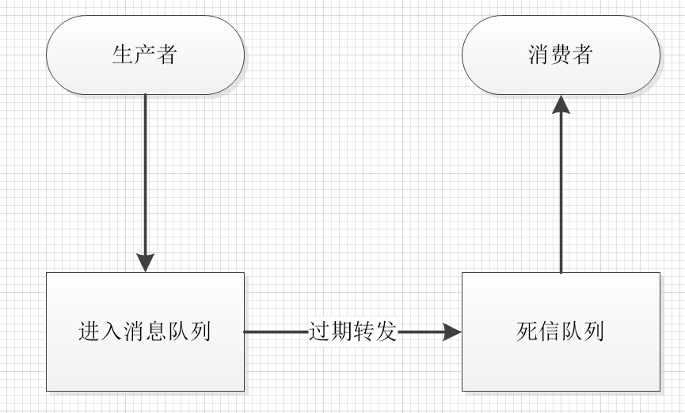
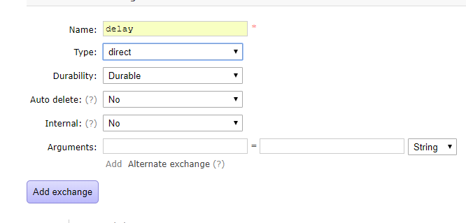
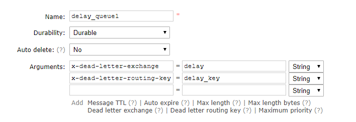
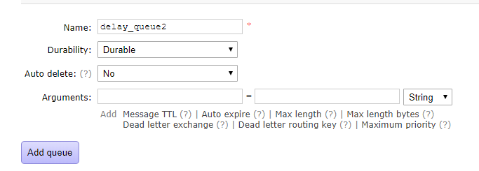
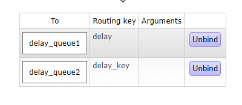

# Rabbitmq延迟队列实现定时任务

开发中经常需要用到定时任务，对于商城来说，定时任务尤其多，比如优惠券定时过期、订单定时关闭、微信支付2小时未支付关闭订单等等，都需要用到定时任务，但是定时任务本身有一个问题，一般来说我们都是通过定时轮询查询数据库来判断是否有任务需要执行，也就是说不管怎么样，我们需要先查询数据库，而且有些任务对时间准确要求比较高的，需要每秒查询一次，对于系统小倒是无所谓，如果系统本身就大而且数据也多的情况下，这就不大现实了，所以需要其他方式的，当然实现的方式有多种多样的，比如Redis实现定时队列、基于优先级队列的JDK延迟队列、时间轮等。因为我们项目中本身就使用到了Rabbitmq，所以基于方便开发和维护的原则，我们使用了Rabbitmq延迟队列来实现定时任务.

### Rabbitmq延迟队列

Rabbitmq本身是没有延迟队列的，只能通过Rabbitmq本身队列的特性来实现，想要Rabbitmq实现延迟队列，需要使用Rabbitmq的死信交换机（Exchange）和消息的存活时间TTL（Time To Live）

### 死信交换机

一个消息在满足如下条件下，会进死信交换机，记住这里是交换机而不是队列，一个交换机可以对应很多队列。

- 一个消息被Consumer拒收了，并且reject方法的参数里requeue是false。也就是说不会被再次放在队列里，被其他消费者使用。
- 上面的消息的TTL到了，消息过期了。
- 队列的长度限制满了。排在前面的消息会被丢弃或者扔到死信路由上。

死信交换机就是普通的交换机，只是因为我们把过期的消息扔进去，所以叫死信交换机，并不是说死信交换机是某种特定的交换机。

### 消息TTL（消息存活时间）

消息的TTL就是消息的存活时间。RabbitMQ可以对队列和消息分别设置TTL。对队列设置就是队列没有消费者连着的保留时间，也可以对每一个单独的消息做单独的设置。超过了这个时间，我们认为这个消息就死了，称之为死信。如果队列设置了，消息也设置了，那么会取小的。所以一个消息如果被路由到不同的队列中，这个消息死亡的时间有可能不一样（不同的队列设置）。这里单讲单个消息的TTL，因为它才是实现延迟任务的关键。

```shell
byte[] messageBodyBytes = "Hello, world!".getBytes();
AMQP.BasicProperties properties = new AMQP.BasicProperties();
properties.setExpiration("60000");
channel.basicPublish("my-exchange", "queue-key", properties, messageBodyBytes);
```
可以通过设置消息的expiration字段或者x-message-ttl属性来设置时间，两者是一样的效果。只是expiration字段是字符串参数，所以要写个int类型的字符串：

当上面的消息扔到队列中后，过了60秒，如果没有被消费，它就死了。不会被消费者消费到。这个消息后面的，没有“死掉”的消息对顶上来，被消费者消费。死信在队列中并不会被删除和释放，它会被统计到队列的消息数中去

### 处理流程图



# 2. 创建交换机（Exchanges）和队列（Queues）

### 创建死信交换机

如图所示，就是创建一个普通的交换机，这里为了方便区分，把交换机的名字取为：delay



### 创建自动过期消息队列

这个队列的主要作用是让消息定时过期的，比如我们需要2小时候关闭订单，我们就需要把消息放进这个队列里面，把消息过期时间设置为2小时



创建一个一个名为delay_queue1的自动过期的队列，当然图片上面的参数并不会让消息自动过期，因为我们并没有设置x-message-ttl参数，如果整个队列的消息有消息都是相同的，可以设置，这里为了灵活，所以并没有设置，另外两个参数x-dead-letter-exchange代表消息过期后，消息要进入的交换机，这里配置的是delay，也就是死信交换机，x-dead-letter-routing-key是配置消息过期后，进入死信交换机的routing-key,跟发送消息的routing-key一个道理，根据这个key将消息放入不同的队列

### 创建消息处理队列

这个队列才是真正处理消息的队列，所有进入这个队列的消息都会被处理
 


消息队列的名字为delay_queue2

### 消息队列绑定到交换机

进入交换机详情页面，将创建的2个队列（delay_queue1和delay_queue2）绑定到交换机上面

### 消息队列绑定到交换机

进入交换机详情页面，将创建的2个队列（delay_queue1和delay_queue2）绑定到交换机上面


自动过期消息队列的routing key 设置为delay

绑定delay_queue2


delay_queue2 的key要设置为创建自动过期的队列的x-dead-letter-routing-key参数，这样当消息过期的时候就可以自动把消息放入delay_queue2这个队列中了

绑定后的管理页面如下图：



### 发送消息

```shell
String msg = "hello word";
MessageProperties messageProperties = new MessageProperties();
		messageProperties.setExpiration("6000");
		messageProperties.setCorrelationId(UUID.randomUUID().toString().getBytes());
		Message message = new Message(msg.getBytes(), messageProperties);
		rabbitTemplate.convertAndSend("delay", "delay",message);

```

主要的代码就是

    messageProperties.setExpiration("6000");
    
设置了让消息6秒后过期
  
注意：因为要让消息自动过期，所以一定不能设置delay_queue1的监听，不能让这个队列里面的消息被接受到，否则消息一旦被消费，就不存在过期了

### 接收消息

接收消息配置好delay_queue2的监听就好了

```sql

package wang.raye.rabbitmq.demo1;

import org.springframework.amqp.core.AcknowledgeMode;
import org.springframework.amqp.core.Binding;
import org.springframework.amqp.core.BindingBuilder;
import org.springframework.amqp.core.DirectExchange;
import org.springframework.amqp.core.Message;
import org.springframework.amqp.core.Queue;
import org.springframework.amqp.rabbit.connection.CachingConnectionFactory;
import org.springframework.amqp.rabbit.connection.ConnectionFactory;
import org.springframework.amqp.rabbit.core.ChannelAwareMessageListener;
import org.springframework.amqp.rabbit.listener.SimpleMessageListenerContainer;
import org.springframework.beans.factory.annotation.Autowired;
import org.springframework.context.annotation.Bean;
import org.springframework.context.annotation.Configuration;

@Configuration
public class DelayQueue {
	/** 消息交换机的名字*/
	public static final String EXCHANGE = "delay";
	/** 队列key1*/
	public static final String ROUTINGKEY1 = "delay";
	/** 队列key2*/
	public static final String ROUTINGKEY2 = "delay_key";

	/**
	 * 配置链接信息
	 * @return
	 */
	@Bean
	public ConnectionFactory connectionFactory() {
		CachingConnectionFactory connectionFactory = new CachingConnectionFactory("120.76.237.8",5672);
		
		connectionFactory.setUsername("kberp");
		connectionFactory.setPassword("kberp");
		connectionFactory.setVirtualHost("/");
		connectionFactory.setPublisherConfirms(true); // 必须要设置
		return connectionFactory;
	}
	
	/**  
	 * 配置消息交换机
     * 针对消费者配置  
        FanoutExchange: 将消息分发到所有的绑定队列，无routingkey的概念  
        HeadersExchange ：通过添加属性key-value匹配  
        DirectExchange:按照routingkey分发到指定队列  
        TopicExchange:多关键字匹配  
     */  
    @Bean  
    public DirectExchange defaultExchange() {  
    	return new DirectExchange(EXCHANGE, true, false);
    } 
   
    /**
     * 配置消息队列2
     * 针对消费者配置  
     * @return
     */
    @Bean
    public Queue queue() {  
       return new Queue("delay_queue2", true); //队列持久  
  
    }
    /**
     * 将消息队列2与交换机绑定
     * 针对消费者配置  
     * @return
     */
    @Bean  
    @Autowired
    public Binding binding() {  
        return BindingBuilder.bind(queue()).to(defaultExchange()).with(DelayQueue.ROUTINGKEY2);  
    } 

    /**
     * 接受消息的监听，这个监听会接受消息队列1的消息
     * 针对消费者配置  
     * @return
     */
    @Bean  
    @Autowired
    public SimpleMessageListenerContainer messageContainer2(ConnectionFactory connectionFactory) {  
        SimpleMessageListenerContainer container = new SimpleMessageListenerContainer(connectionFactory());  
        container.setQueues(queue());  
        container.setExposeListenerChannel(true);  
        container.setMaxConcurrentConsumers(1);  
        container.setConcurrentConsumers(1);  
        container.setAcknowledgeMode(AcknowledgeMode.MANUAL); //设置确认模式手工确认  
        container.setMessageListener(new ChannelAwareMessageListener() {

			public void onMessage(Message message, com.rabbitmq.client.Channel channel) throws Exception {
				byte[] body = message.getBody();  
                System.out.println("delay_queue2 收到消息 : " + new String(body));  
                channel.basicAck(message.getMessageProperties().getDeliveryTag(), false); //确认消息成功消费  
				
			}  
  
        });  
        return container;  
    }  
    
   
}
```

在消息监听中处理需要定时处理的任务就好了，因为Rabbitmq能发送消息，所以可以把任务特征码发过来，比如关闭订单就把订单id发过来，这样就避免了需要查询一下那些订单需要关闭而加重MySQL负担了，毕竟一旦订单量大的话，查询本身也是一件很费IO的事情

### 总结

基于Rabbitmq实现定时任务，就是将消息设置一个过期时间，放入一个没有读取的队列中，让消息过期后自动转入另外一个队列中，监控这个队列消息的监听处来处理定时任务具体的操作

